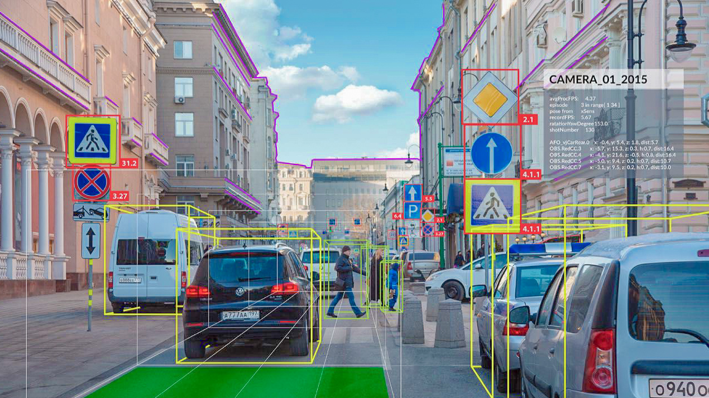
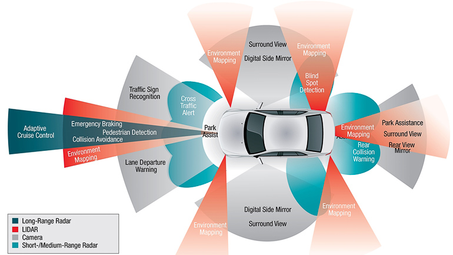
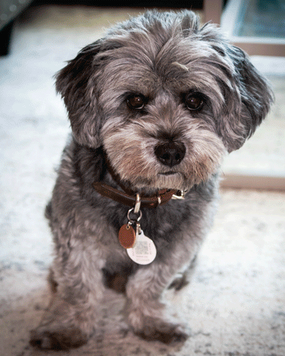

# Classifying street signs using Deep Learning

## Background/Motivation:
 

According to the [National Safety Council](https://www.nsc.org/road-safety/safety-topics/fatality-estimates), approximately 40,000 people died in automotive accidents in the United States in 2018.  Since the invention of the automobile, manufacturers have steadily added more safety features and improved car design over time with the goal of keeping drivers safer on the road. Automotive manufacturers have spent millions of dollars researching safety improvements for seatbelts, tires, and pretty much every car piece or part imaginable. Despite all of this investment, driving remains substantially more fatal than alternatives such as [air travel](https://www.theguardian.com/world/2019/jan/02/plane-crash-deaths-jump-sharply-in-2018-but-fatalities-still-rare) in 2019. 
 

*Image Source: yonah.org*
 
 

While there are many factors that likely contribute to this drastic difference, such as the varying difficulty in training and certification required to be a commercial pilot vs obtaining a drivers licence, the difference in mortality rate remains staggering. In fact, there were a total of ~500 deaths resulting from plane crashes recorded globally in 2018 - that's **80 times** fewer deaths when compared to car crash fatalities **in the US only**.

Through the advent of artificial intelligence, we're now able to apply new techniques to many "old" problems, including automotive safety. 

> Today, companies such as Tesla, Volvo, and many others are investing into technology such as Artificial Intelligence that seeks to correct the root cause of the issue, and the one we've previously ignored - *human performance behind the wheel*.

Perhaps the most exciting advancement in automative technology since the invention of the car itself is the birth of the self-driving, or autonomous car.  Once the topic of Science Fiction, Convolutional Neural Networks (CNNs) and other modeling techniques have pushed the bounds of "possible" into the realm of human imagination. There are 3 major challenges we must overcome in order to make self driving technology possible. We must be able to do the following, very quickly:

> 1. Obtain the data (sensors, cameras)
> 2. Process the data (artificial intelligence - our focus here)
> 3. Act on the data (drive the car)
 
 

*Image courtesy of https://www.sae.org/*
 
 

In this experiment, we'll focus exclusively on a simplified application of step 2, *processing image data in order to determine what it is we're "looking at"*, in this case, street signs. To accomplish this goal, 100,000 images containing 43 labeled (pre-classified) street signs were used to train supervised Deep Learning models that utilized CNNs and Transfer Learning to classify each type of street sign.
 
 

Adhering to the [OSEMN](https://medium.com/breathe-publication/life-of-data-data-science-is-osemn-f453e1febc10) pipeline, we will load image/label data, pre-process/scrub image data, and visualize any trends and noteworthy distributions amongst features/target variables in the dataset prior to modeling.
 
 

Following exploratory data analysis, we'll use Deep Learning methods, CNNs and Transfer Learning to classify the street signs in the database. When evaluating the results of our models, it is important to consider the potential ramifications of a mistake. In the case of self-driving cars, a misidentified stop sign *or pedestrian* could cost a life. However, for the purposes of this inquiry, we will not define an "acceptable" margin of error.
 
 

In a future study, the importance of misclasification of each sign could be evaluated, given a weight, and the experiment should be repeated. In this way, a new model could be trained to "err on the side of caution" when classifying more critical street signs. Additionally, the ethics behind these choices should be evaluated. If our weighted inputs caused our new model to make fewer mistakes classifying stop signs, for example, but performed slightly worse on classifying pedestrian crossing signs, would that be "acceptable"? These are the types of evaluations that must be considered before we "hand over the keys" entirely.

To improve the experiment further, additional sign-data could be generated using Generative Adversarial Networks (GANs) and used to improve model performance. Based on model performance, fatality could then be predicted using available crash statistics in order to give context to the performance of each model.
 
 

Before beginning our modeling and analysis, we'll briefly discuss how convolutional neural networks allow us to train computers to identify objects. As humans, when we look at a picture, like the example below, we see a cute dog with black and grey fur. Without thought, we know that the subject of the image isn't a horse, car, or cat. 

Even when viewing an example of a heavily edited photo I took, as humans we still have no difficulty in identifying that the subject of the image is a dog, even though he is blue. Take a look:

Computers, unsurprisingly, have no notion of what a dog is, much less what one looks like. Instead, computers see images as grouped matrices called tensors. In each matrix, each number corresponds to a specific pixel in the image. Put simply, an image with the dimensions of 32x32x3 contains 3 matrices (representing the Red, Green, and Blue color channels) that are 32 pixels in height, and 32 pixels in width.

Using a convolutional neural network, we are able to train models to extract image "features" such as edges, shapes, and colors. Using supervised learning techniques, we can pass thousands of images of dogs of all breeds through a model in order to "teach the computer" what a dog looks like. So, while a computer may not appreciate how cute my dog Oliver is, by applying different filters to his portrait, it can determine that Oliver's facial structure, color, and shape share similarities with other dogs.

In the links below, we'll explore these techniques discussed here, and create models that classify street signs into 43 target classes.

Notebooks/Links of Interest:**
- [Modeling](/traffic_signs_modeling.ipynb)
- [Image pre-processing](/image_preprocessing.ipynb)
